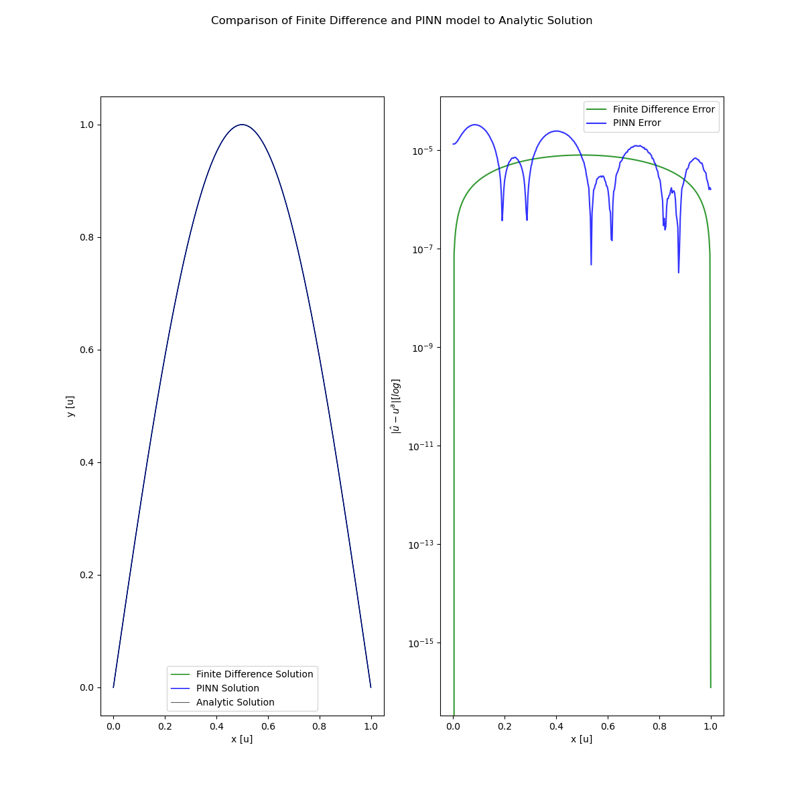

# PINN 

Projects involving Physics informed Neural Networks to gain better understanding of their use in numeric methods, specifically in the field of partial differential equations 

### Simple Steady State 

The following ordinary differential equation given by the boundary value problem: 

$u''(x)=-\pi^2\sin(\pi x), x\in(0,1)$, boundary conditions, $u(0) = 0$ and $u(1) = 0$

We can solve using a finite difference scheme with truncation error $\sim O(h^2)$ to solve the system, as well as by training a PINN using the ode. We can see a comparison of the two in the given plot below,  

